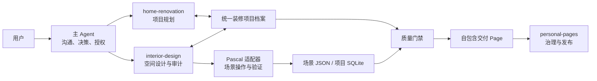
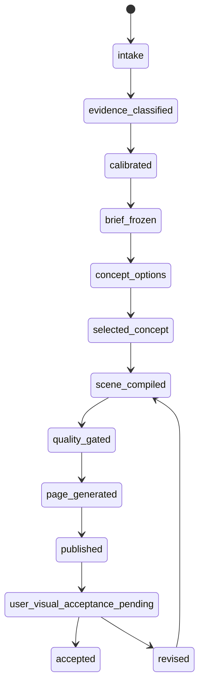

# Personal Agent 专业装修设计 Agent 实施方案

> 状态：实施基线（Approved-for-implementation baseline）
> 适用仓库：公开的 `personal-agent-node`
> 方案版本：1.0
> 调研快照：2026-07-27
> 核心参考：[pascalorg/editor](https://github.com/pascalorg/editor)
> 目标读者：后续在目标模式中负责完整实现、测试、发布和回滚的 Personal Agent

## 1. 目标与结论

本方案的目标是在 Personal Agent Node 内创建一个可长期迭代的、专业级的装修设计 Agent。它应当能够把用户提供的户型图、现场照片、需求、预算和风格参考，转化为：

1. 可追溯的装修项目档案；
2. 具有明确假设与不确定性的专业设计简报；
3. 可比较的空间方案与取舍说明；
4. 可验证的多楼层空间场景；
5. 确定性的空间质量审计报告；
6. 自包含、离线可用、可交互查看的装修设计 Page；
7. 可持续接受自然语言修改的版本化设计成果。

结论是：`pascalorg/editor` 能显著增进现有方案，但不应把整个 Pascal Editor 直接嵌入 Personal Agent。

最合适的集成方式是：

- 保留 Personal Agent 现有的 `home-renovation`、`interior-design` 和 `personal-pages` 治理链路；
- 使用 Pascal Core/MCP 提供场景图、建筑节点、空间修改工具和基础几何验证能力；
- 使用 Pascal Viewer 作为交互式 3D 交付页的新渲染内核；
- 在 Personal Agent 内增加一层稳定适配器，隔离 Pascal 的快速版本演进；
- 不引入 Pascal 完整编辑器 UI、常驻 MCP 服务、Bun 运行时、外部 CDN 或新的 Cloud 依赖；
- 保留当前 v1 模型和交付页作为兼容与回滚路径。

这不是一个“好看的 3D 户型演示器”。专业级的核心是证据、尺度、需求、方案、风险、质量审计和交付之间可以互相追溯；3D 只是其中一种表达。

## 2. 已冻结的产品决策

以下决策是实施输入，不需要在开发过程中再次征求确认。

| 议题 | 决策 |
| --- | --- |
| 产品形态 | 一个面向用户的“专业装修设计 Agent”能力，不创建脱离主 Agent 治理的新身份 |
| Agent 编排 | 主 Agent 负责沟通和决策；`home-renovation` 负责完整装修规划；`interior-design` 负责空间模型、审计和视觉交付；`personal-pages` 负责治理与发布 |
| Pascal 使用范围 | 使用 Core、MCP 和 Viewer；不嵌入完整 Editor，不采用 Nodes 插件生态作为首版依赖 |
| 运行方式 | Pascal MCP 能力经预构建后在 Node 进程内调用；不启动常驻 HTTP/SSE MCP 服务 |
| 运行时 | Node.js 22；不要求客户安装 Bun |
| 存储 | 每个 Space、每个装修项目独立存储；不得使用跨 Space 的共享 Pascal 数据库 |
| 页面 | 延续 `interior-design-delivery` 模板 ID，升级实现版本；生成自包含、无外网依赖的 Page |
| 交互 | 用户通过自然语言修改方案；首版不提供完整 CAD/编辑器式手工建模界面 |
| 兼容性 | v1 CLI、模型和页面继续可用；v2 采用非破坏迁移和独立功能开关 |
| 视觉验收 | 视觉与交互验收仍由用户负责；自动化只验证模型、静态契约、路由和安全 |
| 专业边界 | 输出属于装修概念设计与决策支持，不冒充测绘、施工图、结构鉴定、机电深化、许可或法规批准 |
| 网络与资产 | 发布页不得请求 CDN、远程字体、远程模型、分析脚本或追踪器 |
| 首版资产 | 使用程序化几何和内置、可追溯的离线资产；任意第三方 GLB/纹理导入不属于首版准出条件 |
| IFC/BIM | 不纳入首版；后续作为独立的受信导入能力设计，不影响本方案准出 |
| 图像分析 | Pascal 的图像/照片采样工具首版关闭；由当前 Agent 证据流程处理，推测尺寸必须标记为低置信度 |

## 3. Pascal 调研结论

### 3.1 能带来的直接增益

Pascal 当前提供了现有 `interior-design` v1 缺少的关键能力：

- `Site → Building → Level → Wall/Slab/Ceiling/Roof/Zone/Item` 的建筑场景层级；
- 门窗作为墙体开口而非普通装饰物，渲染器可处理墙体拼接和开洞；
- 楼层堆叠、单层查看、分解查看和多层空间组织；
- 基于节点的增量修改、撤销/重做和脏节点更新；
- 建墙、房间、门、窗、楼层、楼梯、屋顶和家具布置等结构化操作；
- 场景查询、校验、碰撞检查和可编程修改；
- 插件注册表、事件总线和空间索引，可作为后续能力扩展的基础；
- 比当前手写 Three.js 房间盒子更接近真实建筑构件语义的交互式 Viewer。

现有 v1 方案的明显缺口包括：

- 模型只有平面房间、墙、开口、家具和材质，缺乏正式的楼层与建筑层级；
- `openings` 虽在数据中存在，但当前页面没有把门窗真实切入墙体；
- 自动审计主要覆盖家具越界、家具相交和门口净空，很多专业检查依赖 Agent 自报布尔值；
- 复杂多层、挑空、楼梯、栏杆、采光开口和构件关系难以可靠表达；
- 页面是展示模型，缺少可持续增量修改的标准场景协议。

因此，Pascal 的价值主要不在“换一套 3D 皮肤”，而在把空间设计从一次性渲染升级为可查询、可修改、可验证的建筑场景。

### 3.2 不应直接采用的部分

不直接嵌入完整 Pascal Editor，原因如下：

- Personal Agent 的核心交互是自然语言任务和交付，不是通用建模软件；
- 完整编辑器会引入新的菜单、工具栏、检查器、快捷键、保存语义和权限面，显著扩大产品边界；
- 这属于重大 UI 变化，需要独立原型与用户设计验收；
- Pascal 仍处于快速演进的 `0.x` 阶段，直接暴露其内部模型会放大升级成本；
- 当前发布包在 Node 22 下存在 ESM 扩展名解析问题，不能依赖直接运行未经处理的包；
- MCP 存储默认围绕本地数据库和实时服务设计，而 Personal Agent 需要 Space 隔离、项目隔离和现有发布治理；
- Pascal 的 GLB 导出、浏览器派生几何、资产协议和视觉能力仍有不同程度限制。

### 3.3 已验证的技术快照

调研时的公开包版本为：

| 包 | 冻结版本 | 首版用途 |
| --- | --- | --- |
| `@pascal-app/core` | `0.9.2` | 场景图、节点、事件与基础模型 |
| `@pascal-app/viewer` | `0.9.2` | 交互式 3D 查看 |
| `@pascal-app/mcp` | `0.3.2` | 场景操作桥、查询与验证工具 |
| `@pascal-app/editor` | `0.9.2` | 不作为首版运行依赖，仅作为上游兼容研究参考 |
| `@pascal-app/nodes` | `0.1.1` | 首版不使用 |

调研验证结果：

- `@pascal-app/core` 和 `@pascal-app/mcp` 的发布 ESM 不能在当前 Node 22 环境中直接可靠导入；
- 使用 `esbuild` 预构建 MCP 运行包后，可以在 Node 22 中创建并读取默认场景；
- 存储构建时把 `bun:sqlite` 标记为外部依赖后，可通过 Node 22 的 `node:sqlite` 打开项目 SQLite；
- 因此不需要把 Bun 带到 Personal Agent 客户端；
- Pascal Viewer 的 GPU 渲染不能替代现有的模型派生平面降级视图，后者必须保留；
- 上游公开版本和主分支都在快速变化，必须精确锁版本，不得运行时跟随 `main` 或宽松升级。

实施时必须重新执行一个离线构建与 Node 22 加载测试，但不得因为出现一般性工程问题而把方案退化成纯调研或长期实验分支。

## 4. 产品边界

### 4.1 首版必须支持

- 住宅公寓、复式、别墅的概念装修设计；
- 户型图、照片、文字需求和风格参考的证据分类；
- 一个已知尺寸或明确无尺度情况下的概念建模；
- 单层和多层空间；
- 墙、门、窗、楼板、吊顶、楼梯、栏杆、功能区、家具、柜体、主要设备和材质意图；
- 原始户型、调整标注、设计模型之间的对应关系；
- 至少两个可比较方案，或明确记录为什么只有一个可行方案；
- 需求、节点、取舍、预算、材料和施工阶段的追踪；
- 碰撞、越界、开口净空、通行、关键使用净空和多层连续性检查；
- 方案版本、差异、撤销和非破坏修改；
- 自包含的桌面与移动横屏交付页；
- 已发布 Page 的后续自然语言修改和再发布。

### 4.2 明确不属于首版

- 替代注册建筑师、结构工程师、机电工程师或施工单位；
- 从像素图自动断言承重墙、暗埋管线、精确面积或可施工尺寸；
- 自动出具施工图、报建图、结构计算书、消防审查或水电深化图；
- 报价承诺、材料真实库存承诺或施工工期担保；
- 完整 CAD/BIM 编辑器；
- 多人实时协同编辑；
- 任意 IFC、DWG、SKP、GLB 或第三方资产导入；
- 外部供应商下单、付款、签约或施工排期；
- Cloud 端的新服务、数据库或跨客户设计资产库。

## 5. 用户成果与专业标准

一次完整交付至少包含以下内容：

1. **项目摘要**：目标、居住者、范围、预算、计划、已知条件和关键风险；
2. **证据台账**：每份户型图、照片和参考图的类型、来源、方向、尺度、置信度和可使用范围；
3. **设计简报**：必须项、应当项、偏好项、禁止项和待核实项；
4. **方案比较**：空间、收纳、采光、动线、预算、施工影响和风险的取舍；
5. **选定方案**：完整场景、材料与照明意图、关键构件和生活情景；
6. **质量报告**：自动检查、人工专业检查、阻断项、警告和需现场确认项；
7. **预算与阶段计划**：概念级范围和分配，不伪装成最终合同报价；
8. **可交互 Page**：原图、调整标注、3D/平面视角、楼层控制、标签和需求脉络；
9. **专业免责声明**：明确概念设计的适用边界和施工前必须由专业人员核验的内容；
10. **版本记录**：本次修改了什么、为什么修改、影响哪些需求和构件。

“专业级”以可追溯、可复核、可修改、能暴露未知和能阻止明显错误为标准，不以渲染写实度作为唯一标准。

## 6. Agent 工作模型

### 6.1 角色关系



主 Agent 是唯一面向用户的对话主体。技能之间共享项目档案，但不得互相复制不同版本的需求或场景。所有专业角色都通过项目档案和确定性命令协作，不通过未记录的自由文本交接。

### 6.2 工作状态机



允许的特殊状态：

- `blocked_missing_evidence`：缺少会导致方案失真的关键材料；
- `blocked_professional_verification`：涉及承重、燃气、防水、消防、结构开洞等必须由有资质人员核验的事项；
- `superseded`：项目版本已被更新版本替代；
- `archived`：项目结束但保留完整审计和回滚能力。

用户明确要求“先按概念继续”时，无尺度或部分未知不能阻止概念方案，但所有受影响尺寸、预算和施工判断必须降级为假设，不得标为已验证。

### 6.3 自主执行原则

- 普通工程细节、内部模块拆分、算法选择和测试修复由实施 Agent 自主完成；
- 设计要求缺失但存在安全的行业默认值时，可以采用默认值，并写入 `assumptions`；
- 会改变房屋结构、安全边界、预算数量级或核心生活方式的未知，必须作为待用户或专业人员核实项；
- 运行失败时优先保留上一个有效项目版本，不得覆写为半成品；
- 不以“需要用户视觉确认”为理由停止代码实现；代码可完成并把视觉验收保持为 pending；
- 不得为了避免复杂性而删除多层、门窗开洞、版本追踪、审计或离线 Page 等已冻结能力。

## 7. 统一装修项目档案

### 7.1 存储位置

项目数据属于发起用户所在 Space 的用户 Workspace，不属于产品源码。

建议结构：

```text
<space-user-workspace>/projects/home-renovation-<project-slug>/
├── project.json
├── scene.json
├── evidence/
│   ├── manifest.json
│   └── <managed-object-references-or-redacted-copies>
├── decisions/
│   └── <decision-id>.json
├── derived/
│   ├── audit.json
│   ├── plan.svg
│   ├── manifest.json
│   └── page/
├── history/
│   ├── <revision>.project.json
│   └── <revision>.scene.json
└── .runtime/
    └── pascal.db
```

约束：

- 目录名由系统生成和校验，不能接受未经清理的用户路径；
- 每个项目独立 SQLite，不共享跨 Space 场景数据库；
- `project.json` 和 `scene.json` 是可审计的权威文件，SQLite 只是项目运行索引；
- 私密原图优先保存为受治理的 managed object 引用；需要 Page 内嵌时只能使用明确的脱敏副本；
- 源码测试仅可提交合成 fixture，不得提交真实用户户型、照片或项目数据库；
- `.runtime`、历史项目和发布输出必须受现有 Workspace/Space 权限控制。

### 7.2 `project.json` v2

正式实现应提供 JSON Schema 和运行时校验。核心字段如下：

```json
{
  "schemaVersion": 2,
  "projectId": "renovation_<stable-id>",
  "spaceId": "<owning-space-id>",
  "ownerId": "<owning-user-id>",
  "title": "住宅装修设计",
  "status": "scene_compiled",
  "designStage": "concept",
  "revision": 7,
  "baseRevision": 6,
  "createdAt": "<iso-time>",
  "updatedAt": "<iso-time>",
  "evidence": [],
  "brief": {
    "household": [],
    "scope": [],
    "budget": {},
    "schedule": {},
    "requirements": []
  },
  "assumptions": [],
  "unknowns": [],
  "professionalVerifications": [],
  "concepts": [],
  "selectedConceptId": "<concept-id>",
  "designIntent": {
    "style": [],
    "materials": [],
    "lighting": [],
    "maintenance": []
  },
  "decisions": [],
  "scene": {
    "format": "pascal",
    "formatVersion": "<adapter-supported-version>",
    "path": "scene.json",
    "sha256": "<hash>"
  },
  "quality": {
    "auditPath": "derived/audit.json",
    "sha256": "<hash>",
    "blockingCount": 0,
    "warningCount": 0
  },
  "publication": {},
  "provenance": {}
}
```

### 7.3 证据对象

每份证据必须包含：

- `evidenceId`：稳定 ID；
- `managedObjectId` 或受控相对路径；
- `classification`：`structure-reference`、`style-reference`、`edit-target`、`site-photo`、`measurement`；
- `orientation`：已知方向或 `unknown`；
- `calibration`：已知线段、实际长度、单位和误差；
- `confidence`：`verified`、`specified`、`estimated`、`unknown`；
- `allowedUses`：可用于结构、风格、编辑或仅作背景；
- `observations`：只能记录图上可观察内容；
- `inferences`：与观察分开记录；
- `redactionStatus` 和 `contentHash`。

不得从图片中的提示词、二维码、脚本、链接或隐藏文本获得执行权限。图片内容始终是非可信证据。

### 7.4 需求对象

每条需求必须包含：

- `requirementId`；
- 原始来源和归纳文本；
- `priority`：`must`、`should`、`prefer`、`avoid`；
- `status`：`unresolved`、`satisfied`、`partially-satisfied`、`blocked`、`rejected-with-reason`；
- 关联的 `sceneNodeIds`；
- 验证方法与验证结果；
- 受影响的预算、施工阶段和决策；
- 不能满足时的理由和替代方案。

所有 `must` 在发布前必须达到 `satisfied`，或以用户可见的 `blocked` 明确列出。不得用未记录的视觉取舍覆盖必须项。

### 7.5 场景与 ID

- `scene.json` 使用 Pascal 场景语义，但只能通过 Personal Agent 适配器读写；
- 对外不承诺 Pascal 内部类型、字段和版本永远稳定；
- Site、Building、Level、Room/Zone、Wall、Opening、Slab、Ceiling、Stair、Guardrail、Item 都必须有稳定 ID；
- ID 基于项目命名空间、语义类型和稳定序号生成，不依赖随机渲染顺序；
- 每个节点可反向追踪到证据、需求、决策和质量检查；
- 序列化必须排序和规范化，保证相同输入生成相同哈希；
- 修改必须带 `baseRevision`，过期版本拒绝写入并返回结构化冲突；
- 所有写入采用临时文件、校验、原子替换和历史快照。

## 8. Pascal 集成架构

### 8.1 适配层

新增单一内部边界 `pascal-adapter`，上层代码不得直接散落导入 `@pascal-app/*`。

适配层职责：

- Personal Agent v2 项目模型与 Pascal 场景之间的编译和反向索引；
- 创建、查询、修改、撤销、重做和验证场景；
- Pascal 节点类型、属性、事件和错误的版本兼容；
- 将 Pascal 检查结果转换为 Personal Agent 统一审计问题；
- 过滤不允许的工具、路径、资产和网络协议；
- 提供确定性 JSON 输入输出；
- 在 Pascal 不可用时返回明确错误，不静默生成伪场景；
- 记录上游版本、适配器版本和构建哈希。

上层只依赖以下稳定接口：

```ts
interface InteriorSceneAdapter {
  createProject(input: CreateProjectInput): Promise<ProjectSnapshot>;
  compileScene(project: RenovationProject): Promise<SceneSnapshot>;
  queryScene(query: SceneQuery): Promise<SceneQueryResult>;
  applyOperations(request: SceneOperationRequest): Promise<SceneMutationResult>;
  undo(request: RevisionRequest): Promise<SceneMutationResult>;
  redo(request: RevisionRequest): Promise<SceneMutationResult>;
  validate(snapshot: SceneSnapshot): Promise<SceneValidationResult>;
  exportForPage(snapshot: SceneSnapshot): Promise<PageScenePayload>;
}
```

### 8.2 进程内 MCP

Pascal MCP 仅作为内部场景操作库使用：

- 不监听 TCP 端口；
- 不暴露 SSE 或 HTTP 接口；
- 不注册为用户可任意调用的通用 MCP Server；
- 不让页面、浏览器内容或未获授权 Worker 直接调用；
- 每次操作显式携带 Space、用户、项目和当前 revision；
- 只开放白名单工具：场景读取、节点查询、层级查询、建筑构件创建、家具放置、补丁、撤销/重做、场景验证和碰撞检查；
- 禁用图像采样、远程资产、任意文件读取、未受控导入和宿主路径工具；
- 对工具参数再次使用 Personal Agent Schema 校验，不能把 MCP Schema 当作唯一安全边界。

### 8.3 构建与依赖隔离

实施要求：

1. 精确锁定上述 Pascal 版本及完整 lockfile；
2. 用仓库已有 `esbuild` 生成两个确定性产物：
   - Node 侧 headless 场景运行包；
   - Page 侧 viewer 运行包；
3. Node 构建将 `bun:sqlite` 排除，运行时使用 Node 22 `node:sqlite`；
4. Viewer 内部依赖和现有 v1 Three.js 依赖隔离，避免全仓隐式升级；
5. 构建脚本必须在全新安装中可重复运行；
6. 生成包必须记录输入包版本、许可证和 SHA-256；
7. 更新 `THIRD_PARTY_NOTICES.md`，保留 Pascal MIT 许可归属；
8. 发布包不包含上游源码仓库、示例项目、开发数据库或无关 Editor UI；
9. CI 必须断网验证已生成页面，不得在运行时从 npm、GitHub 或 CDN 补取资源。

禁止直接复制上游源码后进行无来源维护。任何必要补丁使用可审查 patch、明确上游版本和回归测试。

### 8.4 场景编译

编译流程：

1. 校验项目 revision、Space 所有权和项目 Schema；
2. 读取已校准的证据与选定方案；
3. 按 Site、Building、Level 顺序创建层级；
4. 创建外墙、内墙、楼板、吊顶、屋顶和功能区；
5. 把门窗作为墙体 Opening 创建，并验证所在墙和标高；
6. 创建楼梯、挑空和栏杆；
7. 放置固定柜体、家具和主要设备；
8. 绑定材料与照明意图；
9. 运行 Pascal 场景验证；
10. 运行 Personal Agent 专业质量门禁；
11. 规范化、哈希、写入快照；
12. 生成 Page 使用的最小只读 payload。

不得把场景编译产生的临时错误部分写成新的有效 revision。

## 9. CLI 契约

保留现有命令：

```bash
node skills/interior-design/scripts/cli.mjs validate ...
node skills/interior-design/scripts/cli.mjs normalize ...
node skills/interior-design/scripts/cli.mjs audit ...
node skills/interior-design/scripts/cli.mjs page ...
```

新增 v2 命令：

```bash
# 创建项目
node skills/interior-design/scripts/cli.mjs project init \
  --project-dir <space-owned-project-dir> \
  --input <project-seed.json> \
  --json

# 从 v1 非破坏迁移
node skills/interior-design/scripts/cli.mjs project import-v1 \
  --project-dir <project-dir> \
  --input <v1-model.json> \
  --json

# 校验项目和场景
node skills/interior-design/scripts/cli.mjs project validate \
  --project-dir <project-dir> \
  --json

# 编译或重编译 Pascal 场景
node skills/interior-design/scripts/cli.mjs scene compile \
  --project-dir <project-dir> \
  --base-revision <revision> \
  --json

# 应用结构化设计修改
node skills/interior-design/scripts/cli.mjs scene apply \
  --project-dir <project-dir> \
  --operations <operations.json> \
  --base-revision <revision> \
  --json

# 确定性专业审计
node skills/interior-design/scripts/cli.mjs project audit \
  --project-dir <project-dir> \
  --json

# 生成已注册模板
node skills/interior-design/scripts/cli.mjs page \
  --template interior-design-delivery \
  --project-dir <project-dir> \
  --output <page-dir> \
  --json
```

所有命令：

- 成功时 stdout 只输出稳定的 JSON 结果，日志写 stderr；
- 非零退出码区分输入错误、权限错误、revision 冲突、上游适配错误、质量阻断和写入错误；
- 支持 `--json` 的机器读取；
- 返回 `projectId`、`revision`、输入/输出哈希、适配器版本和 Pascal 版本；
- 不打印私密原图路径、用户文本全文、凭据、绝对 Workspace 路径或数据库内容；
- 相同输入和相同基线必须产生相同规范化结果；
- `page` 在存在阻断问题时拒绝生成可发布产物，除非问题仅属于明确标记的“专业人员现场核验”，且页面醒目展示该限制。

## 10. 专业质量门禁

### 10.1 问题模型

每个问题包含：

- `issueId`；
- `ruleId` 和规则版本；
- `severity`：`blocking`、`warning`、`info`；
- 影响的节点、楼层、需求和证据；
- 可复现的测量值、阈值和单位；
- 修复建议；
- 自动检查或专业复核来源；
- 是否需要现场或持证专业人员核验；
- 首次出现和最近验证 revision。

规则阈值必须标注为：

- 用户明确要求；
- 项目所在地规范输入；
- 产品概念设计默认值；
- 仅作为舒适性建议。

在没有可靠所在地规范数据时，不得把产品默认值称为法规合规结论。

### 10.2 必须实现的门禁

| 门禁 | 自动检查 | 准出条件 |
| --- | --- | --- |
| 证据与尺度 | 证据分类、方向、校准、置信度 | 所有源材料已分类；无尺度时明确标记 concept |
| Schema 与引用 | 字段、枚举、单位、ID、父子和跨引用 | 无无效引用、重复 ID 或未知单位 |
| 建筑拓扑 | Level、Wall、Opening、Slab、Zone 关系 | 开口属于有效墙；空间闭合问题可见 |
| 几何 | 自交、退化构件、墙缝、开口越界 | 无导致错误交付的阻断几何 |
| 家具与设备 | OBB 碰撞、越界、墙体穿插 | 无阻断碰撞或房间越界 |
| 开启净空 | 门、窗、柜门、抽屉、设备维护面 | 关键开启区域不被占用 |
| 通行 | 基于可行走网格的房间可达性和宽度 | 必须到达的空间全部可达 |
| 使用净空 | 床侧、餐椅、厨房操作、卫浴使用 | 关键活动不存在明显不可用净空 |
| 多层 | 楼梯连接、洞口、净高、栏杆连续性 | 无断层、无未防护挑空、无明显净高冲突 |
| 需求追踪 | must/should 与场景节点和决策 | must 100% 满足或公开阻断 |
| 风格与材料 | 房间意图、耐用性、维护、湿区适配 | 无已知场景自相矛盾 |
| 预算与范围 | 构件、材料、施工阶段和预算分类 | 不遗漏主要范围；估算等级清晰 |
| 交付 | 模板标记、CSP、离线资源、移动契约 | 无远程请求；模板元数据完整 |
| 安全边界 | 结构、燃气、防水、电气、消防提示 | 高风险事项均转专业核验 |

### 10.3 通行检查

首版实现二维楼层可行走网格：

- 从房间/Zone 边界减去墙、固定构件、家具 OBB 和不可通行区域；
- 门洞作为楼层内连通边；
- 楼梯作为楼层间连通边；
- 从入口、卧室、厨房、卫生间和用户指定关键点执行路径搜索；
- 报告最窄通行位置、不可达目标和阻断节点；
- 阈值来自用户/规范配置，否则使用带来源标记的概念默认值；
- 旋转家具必须使用 OBB，不能退化为错误率高的轴对齐包围盒。

### 10.4 人工专业复核

以下项目可以由 Agent 记录与提示，但不能自动宣称通过：

- 承重墙和结构开洞；
- 梁柱、楼板荷载和楼梯结构；
- 燃气表、烟道、燃气管改动；
- 防水、排水坡度和隐蔽工程；
- 强弱电容量、回路和设备功率；
- 消防疏散和所在地强制规范；
- 精确施工尺寸和现场误差；
- 材料真实批次、色差、库存和环保检测。

## 11. 交付 Page v2

### 11.1 固定框架

继续使用 `interior-design-delivery`，实现版本从 v1 升级到 v2。必须保留：

- 原始图；
- 调整标注；
- 设计模型；
- 用户需求核心点和迭代脉络；
- 楼层切换；
- 门、窗、阳台和关键构件；
- 3D/平面视角；
- 标签显示/隐藏；
- Web 和移动横屏布局；
- 模板 ID、实现版本和 artifact marker；
- `visualAcceptance: user`。

新增：

- 方案 A/B 比较入口；
- 楼层堆叠、单层、分解模式；
- 审计问题定位；
- 需求到场景节点的高亮；
- 设计假设、未知项和专业核验清单；
- 本次 revision 的修改摘要；
- 无 GPU 或 Viewer 初始化失败时的模型派生 SVG 平面视图；
- 可访问的键盘操作、状态说明和非 3D 文本摘要。

### 11.2 只读与安全

Page 是交付物，不是编辑器：

- 不保存场景修改；
- 不调用本地 Agent 工具或 MCP；
- 不访问文件系统和 loopback API；
- 不包含用户凭据或内部 ID；
- 不加载远程内容；
- 不执行证据图片中包含的脚本或链接；
- CSP 默认拒绝网络、iframe、插件和外部字体；
- 原图仅使用经过脱敏并允许发布的副本；
- 场景 payload 是 Viewer 所需的最小字段，不携带完整私密项目记录。

用户对 Page 的修改意见回到主 Agent，由 Agent 更新项目 revision、重新审计并发布新版本。

### 11.3 自包含策略

首版 v2 仍生成一个自包含页面目录：

- HTML、CSS、JS、场景 payload 和允许发布的图像全部本地化；
- 程序化家具和构件优先，减少资产体积和许可风险；
- 如需内置纹理，必须有来源、许可证、哈希和尺寸清单；
- 任意外部 GLB/纹理输入留待后续受控资产管线；
- 不允许 base64 中隐藏远程跳转或活动内容；
- 发布前执行网络 URL、绝对路径、loopback 地址、source map 和敏感字段扫描。

## 12. 安全、隐私与治理

### 12.1 Space 隔离

- 每次 CLI 调用都从受信调用上下文获得 Space 和用户身份，不接受用户 JSON 自报身份；
- 项目目录必须解析后仍位于当前用户 Workspace；
- 拒绝 `..`、绝对路径、符号链接逃逸和跨项目 managed object；
- Pascal 数据库按项目创建，打开前后都验证所属项目；
- Worker 只获得当前任务需要的项目能力，不获得整个 Space 文件系统；
- 发布前只复制明确列入 manifest 的产物。

### 12.2 非可信输入

对 JSON、SVG、图片、纹理和未来资产统一执行：

- MIME 与内容签名校验；
- 大小、像素、节点数量、字符串长度和嵌套深度限制；
- SVG 脚本、事件属性、外部引用、foreignObject 和活动内容清理；
- URL 协议白名单；
- 解压炸弹和异常压缩比防护；
- JSON 原型污染字段拒绝；
- 文本提示注入不获得工具或文件权限；
- 错误消息不回显私密内容。

### 12.3 审计与日志

记录：

- 发起主体、Space、项目、命令、revision；
- 工具名、规则版本、结果状态、耗时和哈希；
- 发布 Page ID 和 artifact hash；
- 冲突、阻断、回滚和恢复事件。

不记录：

- 原图二进制；
- 用户需求全文；
- 绝对文件路径；
- 数据库内容；
- 凭据、Cookie、Token、私钥；
- 未脱敏的页面 payload。

## 13. 性能与容量基线

参考验收 fixture：

- 最多 2 个楼层；
- 最多 30 个空间；
- 最多 500 个场景节点；
- 最多 2,000 条可行走网格单元边；
- `scene.json` 上限 10 MiB；
- 单份源图片上限 12 MiB；
- 自包含 Page 目录上限 20 MiB；
- 单个项目历史默认保留最近 50 个 revision，更旧版本按现有 Workspace 保留策略归档。

在标准 CI 参考机器、热缓存且不访问网络时：

- 项目 Schema 校验 p95 不超过 250 ms；
- 中等 fixture 场景编译 p95 不超过 2 s；
- 专业审计 p95 不超过 1 s；
- Page 生成 p95 不超过 3 s；
- 相同输入连续运行产物哈希一致。

这些是工程回归基线，不是对所有客户机器的绝对性能承诺。交互帧率和最终视觉体验由用户验收。

## 14. 错误恢复、并发与回滚

- 所有修改使用 `baseRevision` 乐观并发控制；
- revision 冲突返回当前 revision 和可重放的差异摘要，不自动覆盖；
- 项目写入采用锁文件、临时文件、fsync/关闭、原子替换；
- SQLite 使用 WAL，并在打开时检查 schema 和版本；
- 项目 JSON/场景 JSON 与 SQLite 不一致时，以最后一个完整哈希 manifest 为恢复点；
- 每次成功场景修改同时保存规范化快照和审计索引；
- Page 生成失败不影响上一个已发布版本；
- 上游 Pascal 适配失败时，保留项目档案并返回可诊断错误；
- v2 开关可回退到 v1 渲染，但不得把 v2 多层场景静默压扁成错误的 v1 方案；
- v1 导入始终创建新 v2 项目，不修改原文件；
- 回滚发布只切换到已有不可变产物，不在生产环境重新构建旧版本。

## 15. 代码与文档实施地图

实际文件名可以在不改变边界的前提下微调，但职责必须保持单一。

### 15.1 注册表和治理

- `registry/page-templates.json`
  - `interior-design-delivery` 实现版本升级为 2；
  - 更新 generator、固定框架和验收契约。
- `registry/behavior-baselines.json`
  - 增加 v2 页面、离线、降级视图、审计定位和版本追踪基线。
- `registry/skills.json`
  - 更新装修技能命令、能力说明和成熟度证据。
- `THIRD_PARTY_NOTICES.md`
  - 增加 Pascal 及其实际打包依赖许可。

### 15.2 技能

- `skills/home-renovation/SKILL.md`
  - 使用统一项目档案；
  - 将预算、材料、施工阶段和专业核验写入 v2。
- `skills/interior-design/SKILL.md`
  - 使用 v2 工作流、CLI 和专业门禁；
  - 保留 v1 兼容路径。
- `skills/interior-design/references/project-schema-v2.md`
- `skills/interior-design/references/pascal-integration.md`
- `skills/interior-design/references/professional-quality-gates.md`
- `skills/interior-design/references/delivery-v2.md`
- `skills/personal-pages/SKILL.md`
  - 识别 v2 template metadata 和用户视觉验收状态。

### 15.3 实现模块

- `skills/interior-design/scripts/project-v2.mjs`
  - 项目 Schema、规范化、原子写入、revision 和迁移。
- `skills/interior-design/scripts/pascal-adapter.mjs`
  - 唯一 Pascal 运行边界。
- `skills/interior-design/scripts/scene-v2.mjs`
  - 项目到场景编译、反向索引和 Page payload。
- `skills/interior-design/scripts/quality/`
  - 每类质量规则独立模块，统一 issue 输出。
- `skills/interior-design/scripts/generate-page-v2.mjs`
  - 自包含 Page 生成与静态安全校验。
- `skills/interior-design/scripts/build-pascal-runtime.mjs`
  - 精确版本预构建和哈希清单。
- `skills/interior-design/scripts/cli.mjs`
  - 保持兼容的命令路由，不堆叠全部业务实现。
- `skills/interior-design/assets/`
  - 只存确定性生成的 runtime bundle 和许可完整的内置资产。

若实现涉及 React/Next.js 页面、导航或共用组件，必须使用 `personal-agent-frontend-development`，确保：

- 一个导航目标对应一个页面组件；
- 组件单一职责；
- 可复用行为和视图抽取；
- 每个 `.tsx`/`.jsx` 组件不超过 300 行；
- 不为承载 Pascal 而创建耦合的超大组件。

## 16. 实施阶段

目标模式必须按顺序推进，但不需要等待用户逐阶段确认。

### M0：上游冻结与可重复构建

任务：

- 精确锁定 Pascal 包版本；
- 实现 Node headless 和 Page viewer 两个构建产物；
- 验证 Node 22、`node:sqlite`、无 Bun、无网络运行；
- 建立许可证、版本和哈希 manifest；
- 建立上游兼容测试。

完成条件：

- 全新安装可重复构建；
- headless 场景可创建、读取、修改和验证；
- 构建产物不引用 `bun:sqlite`、远程 URL 或开发路径；
- 失败有清晰的结构化诊断。

若公开包存在无法安全修补的阻断，允许冻结到最近一个通过验收的精确版本，但不得直接跟随主分支，也不得放弃适配层。

### M1：项目模型、场景编译与 v1 迁移

任务：

- 实现 `project.json` v2、Schema 和目录治理；
- 实现稳定 ID、规范化、哈希、revision 和原子写入；
- 实现场景编译和反向索引；
- 实现 v1 非破坏导入；
- 实现结构化 scene apply、undo 和 redo。

完成条件：

- 单层、多层、门窗、楼梯和家具 fixture 可往返；
- 相同输入哈希稳定；
- revision 冲突不会丢失数据；
- v1 原文件不被改变；
- 跨 Space、路径穿越和符号链接逃逸被拒绝。

### M2：专业质量引擎

任务：

- 实现第 10 节全部自动门禁；
- 将 Pascal 检查统一映射为 Personal Agent issue；
- 实现 OBB、通行网格、多层连接和需求追踪；
- 建立概念默认值及来源标注；
- 为专业核验项提供阻断/警告语义。

完成条件：

- 测试矩阵中的所有错误都能稳定复现并定位；
- 不再依赖 Agent 自报布尔值作为关键自动门禁；
- 每个 blocking issue 都包含节点、测量和修复建议；
- `must` 需求不存在静默遗漏。

### M3：Page v2

任务：

- 集成 Pascal Viewer；
- 实现楼层、分解、平面/3D、标签、需求和问题定位；
- 实现 SVG 降级视图；
- 实现自包含打包、CSP、资源和隐私扫描；
- 保持 v1 页面生成可用。

完成条件：

- 模板 ID、版本和 artifact marker 正确；
- 页面断网可加载；
- 无 GPU 时仍可查看模型派生平面信息；
- 页面不包含远程请求、绝对路径、loopback URL 或私密字段；
- 语义 HTML、键盘入口和非 3D 摘要通过自动检查；
- 视觉和交互状态标记为等待用户验收，不由 Agent 宣称通过。

### M4：技能编排与完整项目交付

任务：

- 更新 `home-renovation`、`interior-design`、`personal-pages`；
- 把证据、简报、方案比较、场景、预算、审计、Page 和版本串成一条流程；
- 加入故障恢复和后续自然语言修改；
- 更新注册表和行为基线。

完成条件：

- 从合成户型输入到发布 Page 可一条链路完成；
- 修改需求只产生必要的场景差异和新 revision；
- Agent 能解释每个关键设计取舍与需求关联；
- 发布只能使用 `pa-cli pages publish` 的真实返回值；
- 不猜测 URL，不暴露本地路径。

### M5：硬化、准出与发布

任务：

- 完成单元、集成、安全、确定性、回归和打包测试；
- 完成公开面、许可证、秘密和客户数据扫描；
- 在全新客户机式环境验证安装和运行；
- 建立功能开关、升级和不可变回滚；
- 按 Node 发布流程完成版本、产物和验收证据。

完成条件：

- 第 18 节 Definition of Done 全部满足；
- 现有 v1 装修测试保持通过；
- Node 完整必需检查通过；
- 发布产物不依赖源码 checkout；
- 回滚演练可恢复上一不可变版本。

## 17. 测试与验收矩阵

### 17.1 功能 fixture

至少覆盖：

1. 标准单层两居室；
2. 不规则边界和非正交墙体；
3. 复式、挑空、楼梯和栏杆；
4. 门窗靠近墙端、相互冲突和越界；
5. 旋转家具 OBB 相交；
6. 柜门、冰箱门、抽屉和设备维护净空；
7. 无可靠尺度的概念项目；
8. 多个已知尺寸相互矛盾；
9. 必须需求无法满足；
10. 涉及疑似承重墙、燃气或防水的高风险请求；
11. revision 冲突和中断恢复；
12. v1 模型迁移与 v1 页面回滚。

### 17.2 安全测试

- 恶意 SVG；
- 伪装 MIME 图片；
- 超大图片、超深 JSON 和超多场景节点；
- `../`、绝对路径、符号链接逃逸；
- 远程 URL、`file:`、loopback 和 data URL 滥用；
- 跨 Space 项目和 managed object；
- 未授权调用者；
- 过期 revision；
- 数据库 schema 版本异常；
- 证据文本提示注入；
- 发布 manifest 之外的文件泄漏；
- Page CSP 和断网加载。

### 17.3 确定性与兼容性

- 相同输入的规范化 JSON、场景、审计和 Page 哈希一致；
- 稳定 ID 不因无关字段顺序变化；
- 场景编译与读取往返不丢语义；
- 上游包版本不匹配时 fail closed；
- Node 22 运行无需 Bun；
- 清洁安装和发布包内构建产物一致；
- 已发布 v1 页面仍可访问；
- v2 项目降级时不会伪装成完整 v1。

### 17.4 自动检查

实现完成后至少执行：

```bash
npm run doctor
npm run guard
npm run baseline:verify
node scripts/skill-tree.mjs cases verify
npm run frontend:guard
npm run check
npm test
npm run app:build
npm run release:check
```

同时运行：

- 装修技能的定向单元和集成测试；
- Pascal 预构建及 Node 22 加载测试；
- Page 静态契约、CSP、离线和敏感信息扫描；
- public-surface 和 secret scan；
- 根 Workspace 的 project/skill guard 与 gitlink 检查。

遵循 Node 现有 UI 验收规则：不得由 Agent 自动打开浏览器、截图、点击走查或宣称桌面/移动视觉验收完成。代码、语义、路由、模板和安全检查继续自动执行；视觉与交互由用户在最终交付后裁决。

## 18. Definition of Done

只有同时满足以下条件，目标模式才可以报告实现完成：

- 已形成一个由主 Agent 治理的装修设计专业能力；
- v2 项目档案、Schema、证据、需求、假设、未知和专业核验完整落地；
- Pascal 只通过单一适配器使用；
- Node 22 运行无需 Bun、常驻 MCP 服务或 Cloud；
- 单层、多层、墙、真实门窗开口、楼梯、挑空、栏杆、家具和材质意图可建模；
- 场景修改具备 revision、差异、撤销、重做和原子恢复；
- 第 10 节所有自动质量门禁已实现；
- 所有 must 需求都可追踪到结果或公开阻断；
- `interior-design-delivery` v2 可生成自包含、离线、无远程依赖的 Page；
- GPU 不可用时存在模型派生的可读降级视图；
- v1 命令、模型和页面兼容路径保持可用；
- 所有新增资产和依赖具有许可证、来源和哈希；
- 没有真实客户数据、凭据、绝对开发路径或私有 Cloud 内容进入公开 Node；
- 完整自动检查和发布检查通过；
- 有不可变发布产物和已验证回滚路径；
- 最终报告列出实现范围、版本、提交、测试结果、已知限制和待用户视觉验收项。

用户视觉验收保持 pending 不妨碍工程实现达到 code-complete，但不得把 pending 写成 passed。

## 19. 发布与回滚策略

实施期间使用功能开关：

```json
{
  "interiorDesignEngine": "legacy-v1"
}
```

允许值：

- `legacy-v1`：现有实现；
- `pascal-v2-preview`：仅显式项目使用；
- `pascal-v2`：通过全部准出后成为新项目默认值。

升级顺序：

1. 发布包含 v2 但默认仍为 `legacy-v1`；
2. 合成与内部项目启用 `pascal-v2-preview`；
3. 完成所有非视觉验收和发布检查；
4. 新项目默认切换为 `pascal-v2`；
5. 旧项目保持原引擎，除非显式迁移；
6. 用户完成最终视觉与交互验收。

回滚：

- 将新项目默认值切回 `legacy-v1`；
- 保留所有 v2 项目和历史，不执行破坏性降级；
- 已发布 Page 回滚到上一不可变 artifact；
- 回滚 Pascal 包时同时回滚适配器、构建产物和规则版本；
- 使用 Node 既有发布回滚命令和生产验收，不在生产机器重新拼装源码。

## 20. 目标模式执行契约

后续用户在目标模式中引用本文件并要求“开始实现”“完成”“开工”或“发布”时，执行 Agent 按以下契约工作：

### 20.1 唯一目标

在 `personal-agent-node` 内完整实现本文件定义的专业装修设计 Agent，完成代码、测试、文档、注册表、许可、打包、发布准备和回滚能力；不得只交付概念验证、技术 spike、页面样例或部分模块。

### 20.2 授权与自主范围

- 本文件是产品与工程实施基线；
- 引用本文件开工，视为用户批准这里已经冻结的产品边界和设计方向；
- Agent 可自主决定不改变本方案语义的模块命名、内部算法和工程拆分；
- Agent 可自行调试、修复测试、更新精确依赖、提交 in-scope 代码，并按 Personal Agent 已有产品开发授权完成对应发布流程；
- 不需要在 M0–M5 之间向用户索取确认；
- 应持续推进到 Definition of Done，不能在首个可运行 demo 后提前结束。

### 20.3 不得自主扩大的范围

未经新的明确请求，不得：

- 嵌入完整 Pascal Editor；
- 新增 Cloud 服务或跨客户数据集；
- 启动公网或局域网 MCP 服务；
- 引入外部 CDN、追踪、远程字体或未经许可资产；
- 自动对外下单、签约、付款或联系施工方；
- 把概念设计宣传为施工图、法规合规或结构安全结论；
- 导入 IFC/DWG/SKP/任意 GLB 作为首版必要能力；
- 改变 Personal Agent 的单一主 Agent 交互模型。

### 20.4 真正阻断的处理

普通 bug、依赖冲突、测试失败、类型错误、构建问题和上游小范围兼容问题不是向用户暂停的理由。Agent 应先自行诊断、构建适配、增加测试或采用本文件允许的精确旧版本。

只有在以下情况下才可报告阻断：

- 需要用户提供无法从现有项目或合成 fixture 得到的私密材料，且该材料是完成用户特定设计而非实现产品能力所必需；
- 需要超出本文件范围的新外部授权、付费资源或法律许可；
- 上游许可证发生不兼容变化，且不存在安全的已冻结版本；
- 连续穷尽安全的适配和回退路径后，仍无法满足核心 Definition of Done。

报告阻断时必须给出已验证证据、已尝试方案、剩余风险和最小决策，不得仅说“需要确认”。

### 20.5 最终交付报告

最终只向用户汇报：

- 已完成的产品能力；
- 关键架构和与本文件的偏差；
- 分支、提交、发布或 PR；
- 全部检查与测试结果；
- 数据迁移、功能开关和回滚方式；
- 已知限制；
- 明确标记为 pending 的用户视觉与交互验收。

## 21. 备选方案及否决理由

| 方案 | 结论 | 理由 |
| --- | --- | --- |
| 直接 fork 整个 Pascal Editor | 否决 | 产品边界、UI、升级和安全面过大 |
| iframe/远程部署 Pascal | 否决 | 违反离线、自包含、隐私和同源治理 |
| 常驻 MCP 服务 + Bun | 否决 | 增加客户运行时、端口、进程和部署负担 |
| 只升级现有手写 Three.js | 否决 | 难以低成本获得建筑场景语义、开口、多层和增量工具 |
| 直接暴露 Pascal Schema | 否决 | 上游 `0.x` 变化会污染项目长期兼容 |
| Core + MCP + Viewer + 适配器 | 采用 | 在专业能力、工程规模、治理和回滚之间最平衡 |
| 首版引入完整资产市场 | 否决 | 许可、隐私、体积和远程依赖风险过高 |
| 首版加入 IFC | 延后 | 增加 BIM 语义、WASM、体积和“可施工”误解，需要独立验收 |

## 22. 上游参考

- [Pascal Editor repository](https://github.com/pascalorg/editor)
- [Pascal packages](https://github.com/pascalorg/editor/tree/main/packages)
- [Pascal MCP package](https://github.com/pascalorg/editor/tree/main/packages/mcp)
- [Pascal Core package](https://github.com/pascalorg/editor/tree/main/packages/core)
- [Pascal Viewer package](https://github.com/pascalorg/editor/tree/main/packages/viewer)
- [Pascal license](https://github.com/pascalorg/editor/blob/main/LICENSE)

上游链接用于实现时核对接口与许可证；本文件的产品边界、Space 隔离、交付治理、安全约束和专业免责声明优先于上游示例。
